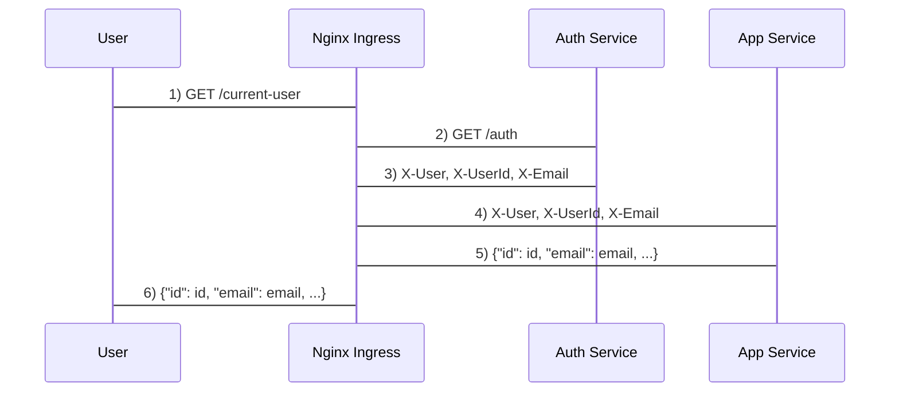

title Homework 5 - API Gateway

User->Nginx Ingress: 1) GET /current-user
Nginx Ingress->Auth Service: 2) GET /auth
Auth Service->Nginx Ingress: 3) X-User, X-UserId, X-Email
Nginx Ingress->App Service: 4) X-User, X-UserId, X-Email
App Service->Nginx Ingress: 5) {"id": id, "email": email, ...}
Nginx Ingress->User: 6) {"id": id, "email": email, ...}

