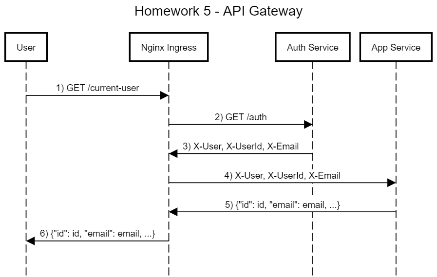

# API



## Auth service (:8181)
- **POST: register** - creates new user
- **POST: login** - creates new session id
- **GET: sign-in** - placeholder for API Gateway redirect
- **GET: auth login user** - validates existing session id
- **GET: logout** - invalidates existing session

## User Service (:8080)

Default Users with ID **1** and **2** are created at the start of the app to have fun with them :)

- **GET: current-user** - fetches current user info, **requires login**
- **GET: users/id** - **requires login**, for demonstration purposes it does not check ownership
- **PUT: users/id** - changes user info, **requires login and same user id**
- **DELETE: users/id** - deletes user, **requires login and same user id**
- **GET: users** - fetches all users, **requires login**, for demonstration purposes

# Deployment
```
minikube addons enable ingress
```
this applies postgres and secrets:
```
kubectl apply -f .
```
this applies manifests for main app:
```
cd app
kubectl apply -f .
```
this applies manifests for auth app:
```
cd ..
cd auth
kubectl apply -f .
```